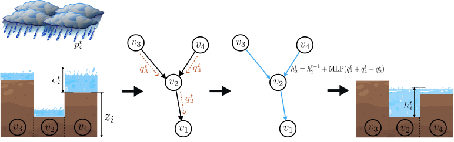

# Pluvial Flood Emulation with Hydraulics-informed Message Passing  

This is the Doss-Gollin lab fork of the original repository for the paper "Pluvial Flood Emulation with Hydraulics-informed Message Passing" by Kazadi, Doss-Gollin, and Silva. Please refer to and cite the [original paper](https://openreview.net/forum?id=kIHIA6Lr0B&noteId=kIHIA6Lr0B) published at ICML 2024.

 

 ## Required Packages
* Python 3.8
* [PyTorch](https://pytorch.org/) 1.12
* [PyTorch Geometry](https://pytorch-geometric.readthedocs.io/) 2.2

## Running the Code 
    python train.py 

## Data 
See details about the data format (including conversion between grid and graph representation) in the jupyter notebook [data_exploration.ipynb](./data_exploration.ipynb). The  processed data can be downloaded from [here](https://zenodo.org/records/12425639). 

- Training set 
    > whiteoak_harvey  
    whiteoak_clearlake  
    whiteoak_jul_2018  
    sanjacintoriver_harvey  
    sanjacintoriver_clearlake  
    sanjacintoriver_jul_2018  
    vince_harvey  
    vince_clearlake  
    vince_jul_2018  

- Validation set 
    > hunting_harvey  
        greens_harvey  
        sims_harvey 

## Cite 
    @inproceedings{kazadi2024pluvial,
        title={Pluvial Flood Emulation with Hydraulics-informed Message Passing},
        author={Kazadi, Arnold and Doss-Gollin, James and Silva, Arlei},
        booktitle={ICML},
        year={2024}
    }

## Getting started with Thunder Compute

1. Basic action for Thunder Computer with API through CLI: tnr create, tnr start ***, tnr connect ***, tnr stop ***, exit.
2. Clone from Github:
   1. cd ~
   2. git clone https://github.com/hawktao035/ComGNN.git
   3. cd ComGNN
   4. mkdir -p checkpoints logs results_test
3. Create the environment and notebook:
   1. python -m pip install --upgrade pip
   2. pip install jupyter papermill nbconvert   # 可选
   3. pip install -r requirement.txt
4. Run ComGNN:
   1. Train & Validation: \
   python train.py 2>&1 | tee -a logs/train.log 
   2. Test: \
   python test.py --device cuda 2>&1 | tee -a logs/test.log
5. tnr scp 0:/home/ubuntu/ComGNN/results_test ./ComGNN_results